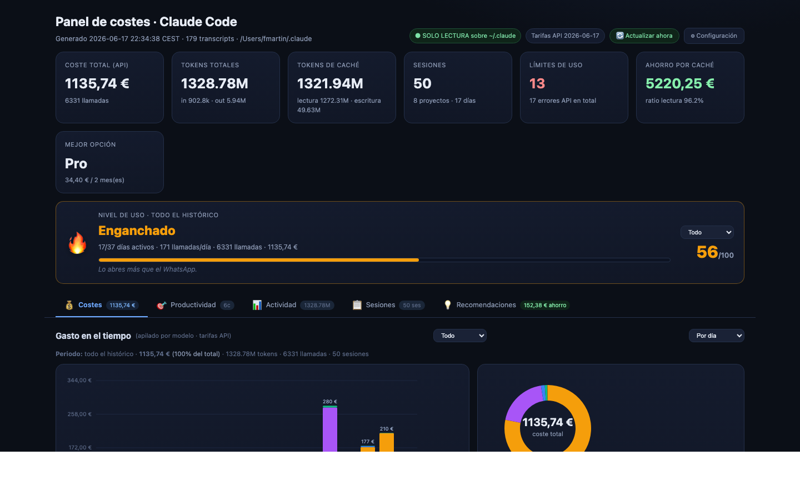
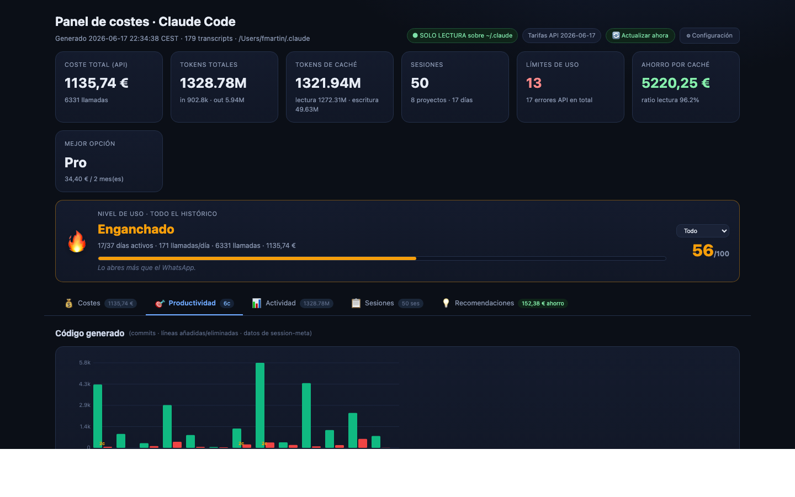
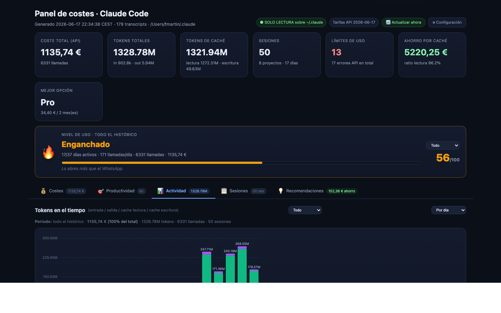
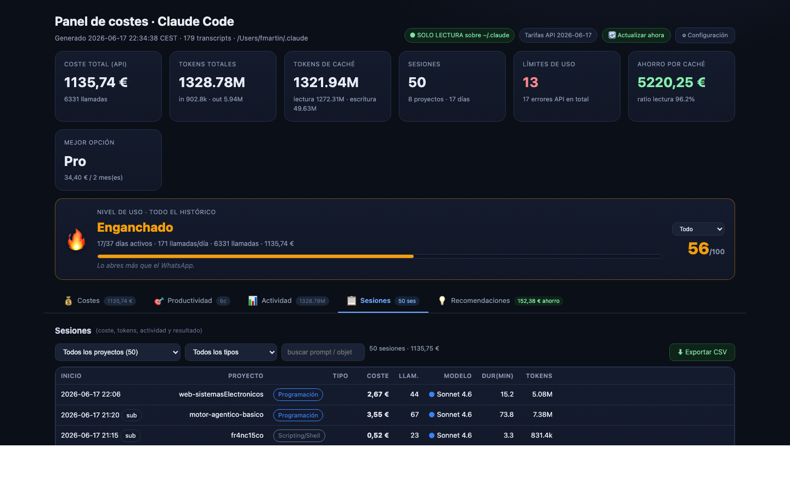
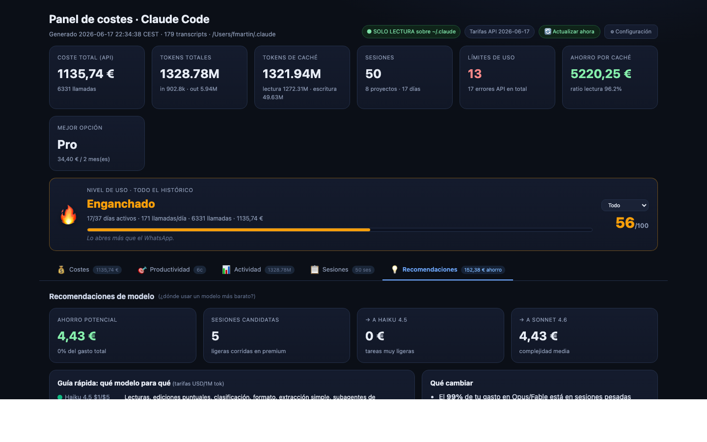

# seeYourClaudeUsage

Panel de análisis de coste para Claude Code. Lee los transcripts de `~/.claude`,
calcula el equivalente a tarifas de API y sirve un dashboard HTML interactivo.

## Inicio rápido

```bash
python3 main.py
```

Eso es todo. El script analiza tus sesiones, arranca el servidor en
`http://localhost:8799` y abre el panel en el navegador automáticamente.

**Requisitos:** Python 3.8+ (sin dependencias externas — no necesitas `pip install`).

---

## Opciones

```bash
python3 main.py --puerto 9000          # puerto distinto
python3 main.py --intervalo 300        # refresco automático cada 5 min
python3 main.py --compartir            # accesible desde otros equipos de la red
```

---

## Capturas de pantalla

<table>
<tr>
<td><b>Costes</b> — KPIs, gasto por día y desglose por modelo</td>
<td><b>Productividad</b> — métricas de sesiones y rendimiento</td>
</tr>
<tr>
<td></td>
<td></td>
</tr>
<tr>
<td><b>Actividad</b> — tokens por día, semana y hora</td>
<td><b>Sesiones</b> — listado con coste, modelo y proyecto</td>
</tr>
<tr>
<td></td>
<td></td>
</tr>
<tr>
<td><b>Recomendaciones</b> — rightsizing, caché y ahorros estimados</td>
<td></td>
</tr>
<tr>
<td></td>
<td></td>
</tr>
</table>

---

## Qué incluye el panel

- **Coste total y por modelo** — cuánto costaría cada sesión a tarifas de API (importes en €, tasa editable)
- **Mes en curso** — gasto del mes, media diaria y proyección a fin de mes
- **Evolución temporal** — selector día / semana / mes y rango (7/30/90 días · mes); heatmap por hora
- **Archivos y patrones** — ficheros más leídos/editados, detección de relecturas intensas, comandos shell más usados
- **Tipos de actividad** — clasificación automática (sin IA) en 11 categorías (Programación, Depuración, Refactorización, Pruebas, Documentación, Exploración, Investigación, Orquestación, DevOps…)
- **Herramientas más usadas** — recuento global de cada tool (Bash, Edit, Read, Agent…)
- **Recomendaciones de modelo** — rightsizing por longitud de sesión y por tipo de actividad; ahorros estimados
- **Proyectos** — desglose por proyecto con coste y sesiones
- **Caché** — tokens leídos/escritos y ahorro estimado por caching
- **Suscripción vs API** — comparativa mensual frente a los planes disponibles con tu plan resaltado
- **Límites alcanzados** — errores de rate-limit y límites de sesión detectados
- **Skills y Tasks** — uso de skills y tareas creadas
- **Auto-mejora** — evolución entre ejecuciones (delta gasto, sesiones, límites)
- **Exportación CSV** — botón en la pestaña Sesiones; también genera `panel_costes/sesiones.csv` en cada ejecución

---

## Alternativa sin servidor (HTML estático)

```bash
cd panel_costes
python3 analizar.py
# Abre panel_costes/panel.html en el navegador
```

Genera un fichero HTML autocontenido (datos embebidos, sin CDN, funciona offline).

---

## Seguridad y privacidad

- Acceso a `~/.claude` **solo en modo lectura** — nunca escribe ni borra nada ahí.
- Toda escritura ocurre exclusivamente en `panel_costes/`.
- El panel generado contiene los prompts de tus sesiones: compártelo solo con quien corresponda.
- `--compartir` no lleva contraseña; úsalo solo en redes de confianza.

---

## Personalizar tarifas

Edita [`panel_costes/precios.json`](panel_costes/precios.json) y vuelve a ejecutar.
Las claves principales:
- `modelos` — USD por 1M tokens (input/output) por modelo
- `suscripciones_usd_mes` — cuota mensual de cada plan para la comparativa
- `eur_por_usd` — tasa para mostrar los importes en €
- `plan_actual` — nombre del plan contratado; se resalta en la comparativa Suscripción vs API

También editables desde el panel en **Sistema → Tarifas** con el servidor en marcha.

---

## Ficheros generados (dentro de `panel_costes/`)

| Fichero | Contenido |
|---|---|
| `panel.html` / `index.html` | El panel visual (autocontenido, sin CDN) |
| `datos.json` | Dataset calculado (inspeccionable) |
| `sesiones.csv` | Detalle de sesiones en CSV (UTF-8 con BOM, abre en Excel) |
| `estado/historial.jsonl` | Una línea por ejecución |
| `estado/resumen.json` | Último resumen + huella de ficheros |
| `estado/memoria.json` | Memoria acumulada entre ejecuciones |
| `estado/insights.md` | Recomendaciones de la última ejecución |
| `estado/eventos_cache.json` | Caché incremental por fichero (acelera el reanálisis) |

---

## Planes de suscripción comparados

| Plan | USD/mes |
|---|---|
| Pro | 20 |
| Teams Standard | 25 |
| Teams Premium 5x | 125 |
| Max 5x | 100 |
| Max 20x | 200 |

> Edita `precios.json` para ajustar según tu factura real.
